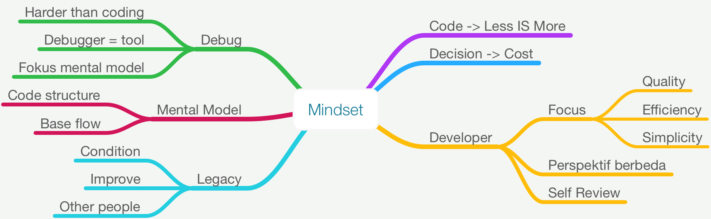
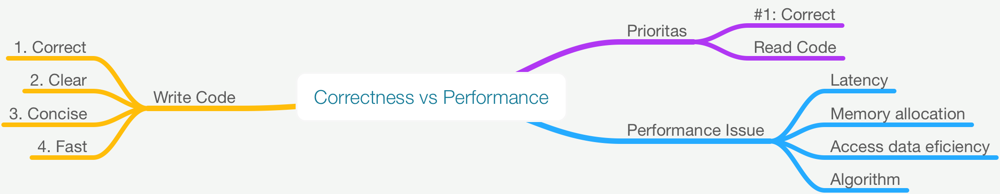
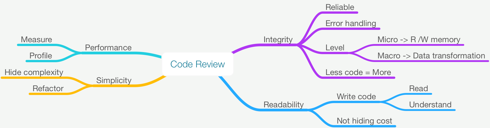

# Lesson 1: Design Guidelines

## 1. Prepare Your Mind

## 2. Productive vs Performance

- Can have both productive and performance
- Go Programming Language: simplify, minimize, reduce amount of code

## 3. Correctness vs Performance

## 4. Code Review

