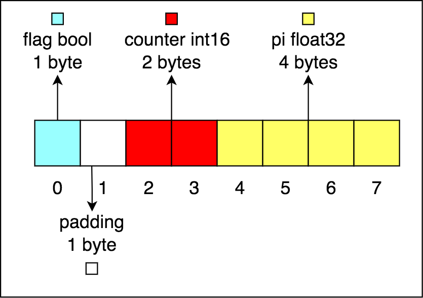

# Struct Types

Struct is a collection of attribute with its data type.

## Declaration

To declare struct, use `type struct_name struct`

ex:

```go
type example struct {
    flag bool
    counter int16
    pi float32
}

var e1 example
e1.flag = true
```

## Initialization

To initialize struct can use:

1. Struct Literal

    ```go
    var e1 example
    e1 = {
        flag: true,
        counter: 10,
        pi: 3.14,
    }

    e2 := {
        flag: true,
        counter: 10,
        pi: 3.14,
    }
    ```

2. Anonymous struct

    ```go
    e3 := struct {
        flag    bool
        counter int16
        pi      float32
    }{
        flag:    true,
        counter: 10,
        pi:      3.14,
    }
    ```

## Struct Conversion

If we have two name type identical struct, we can't assign one to another.

Use explicit convertion to change variable type struct to another type struct. NOTE: Attribute must be same

ex:

```go
type bill struct {
    flag    bool
    counter int16
    pi      float32
}

type alice struct {
    flag    bool
    counter int16
    pi      float32
}

var b bill
var a alice

/**
 * Not possible, cannot use a (variable of type alice) as bill value in assignment */
// b = a

/**
 * Possible, explicit conversion (intentionally convert)
*/
b = bill(a)
```

However, if named struct field same as anonymous struct field, it is possible to directly assign

```go
type bill struct {
    flag    bool
    counter int16
    pi      float32
}

e3 := struct {
    flag    bool
    counter int16
    pi      float32
}{
    flag:    true,
    counter: 10,
    pi:      3.14,
}

// possible
var b bill
b = e3
```

## Data structure alignment

How much memory do we allocate for a data type?

| Date Type | Size    |
|-----------|---------|
| bool      | 1 byte  |
| int16     | 2 bytes |
| float32   | 4 bytes |
| int64     | 8 bytes |

ex:

```go
type example struct {
    flag bool -> 1 byte
    counter int16 -> 2 bytes
    pi float32 -> 4 bytes
}

1 + 2 + 4 = 7 bytes, but is it?
```

It should be `8 bytes`. The reason is because of data structure alignment. Data structure alignment is the way to arrange and access data in memory. The goal of alignment is performance, CPU is faster access memory when data in memory are aligned. There are 2 concepts in data structure alignment, data alignment and padding. NOTE: data alignment and padding is automatically done by compiler.

## Data alignment

- Data alignment is a way to arrange data in memory based on:
  - Data type size (natural alignment)
  - Position: multiple of data type size, start from 0 memory address
- CPU access memory not per byte, but per chunk based on OS architecture

    ex:

    | OS Architecture | Size    |
    |-----------------|---------|
    | 16 bit          | 1 byte  |
    | 32 bi           | 2 bytes |
    | 64 bit          | 4 bytes |

- Golang will allocate memory for date based on its data type size (natural alignment)

    ex:

    | Date Type | Size    |
    |-----------|---------|
    | bool      | 1 byte  |
    | int16     | 2 bytes |
    | float32   | 4 bytes |
    | int64     | 8 bytes |

- For memory position, the position is multiple of data type size start from 0
  - 1 byte: align data at any address
  - 2 bytes: align data at multiple of two address
  - 4 bytes: align data at multiple of four address
  - 8 bytes: align data at multiple of eight address

## Data padding

Data padding is a process to insert extra memory so memory is aligned. To optimize struct, push padding to bottom by lay out the field from highest to smallest.

## Example

```go
type example struct {
    flag bool -> 1 byte
    counter int16 -> 2 bytes
    pi float32 -> 4 bytes
}

When compile, example struct size will be 8 bytes by inserting padding between flag and counter attribute

type example struct {
    flag bool -> 1 byte
    padding -> 1 byte
    counter int16 -> 2 bytes
    pi float32 -> 4 bytes
}
```


